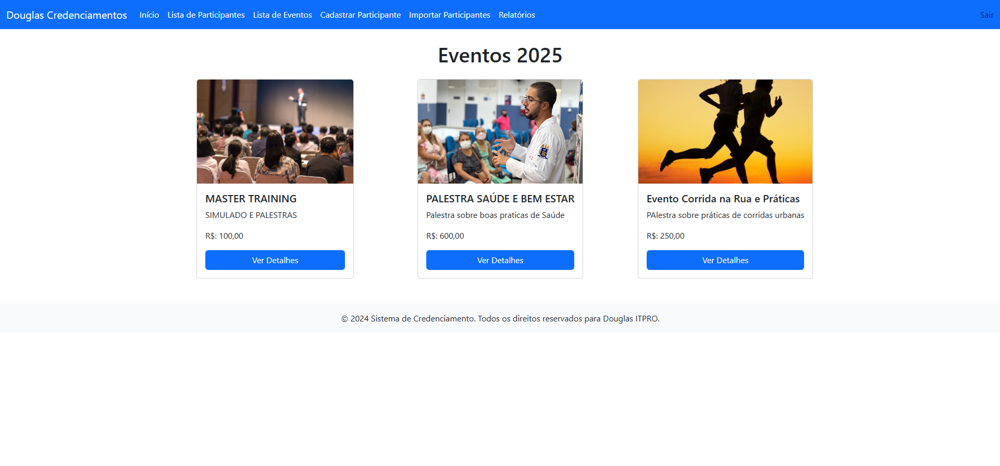
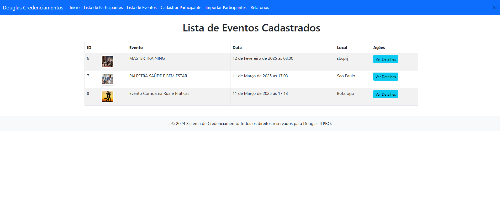
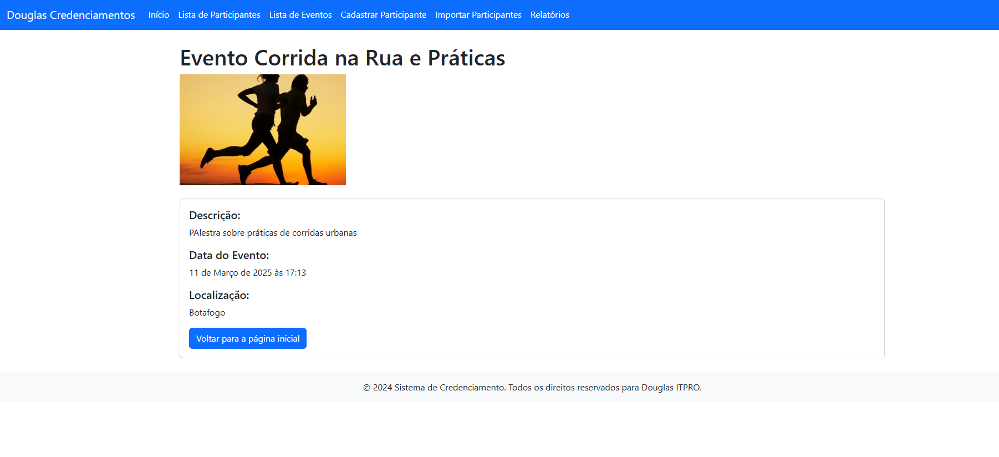
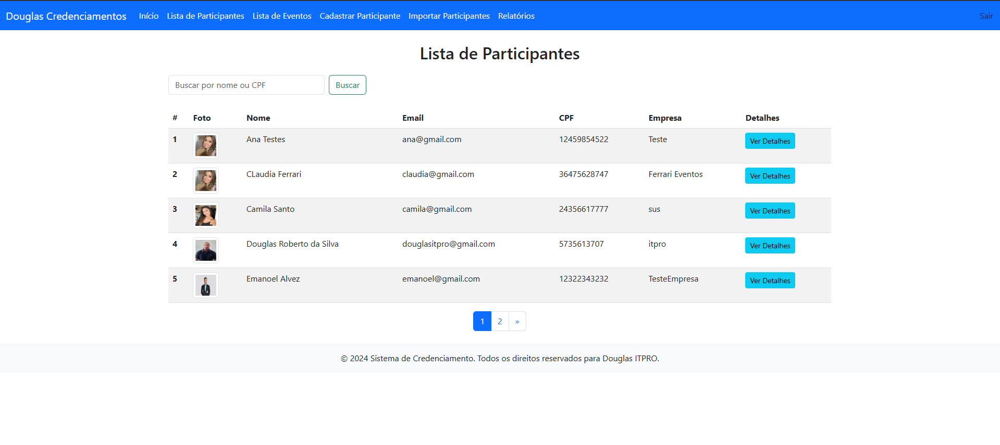
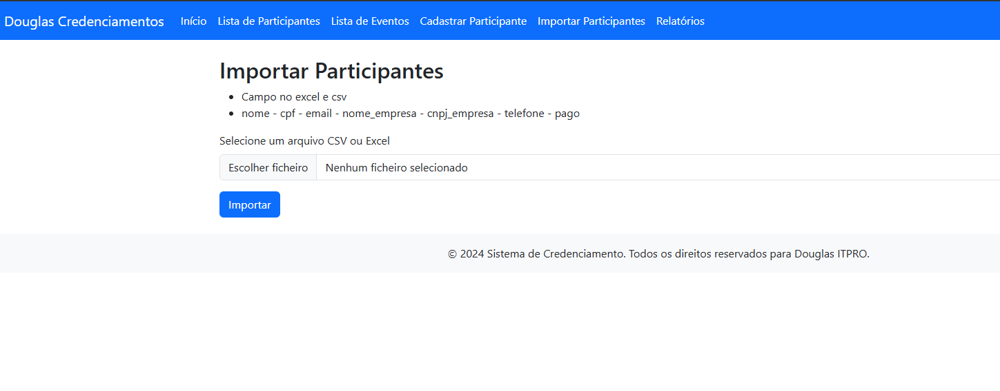
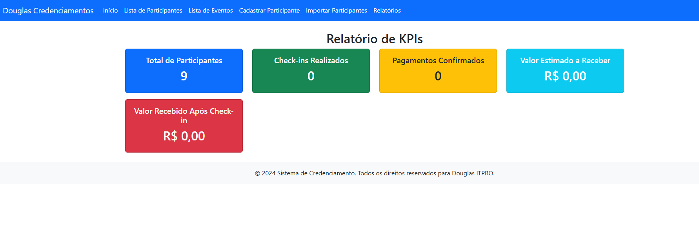

# Sistema de Gestão de Eventos e Participantes

## Descrição do Projeto
Este projeto é um sistema de gestão de eventos e participantes, desenvolvido em Django, que permite a administração de eventos, inscrição de participantes e controle de pagamento e check-in. O sistema também suporta importação de dados via arquivos CSV/Excel e oferece autenticação para controle de acesso.

## Funcionalidades Principais
1. **Gerenciamento de Eventos**:
   - Cadastro de eventos com nome, data de início e término, local, descrição, foto e valor.
   - Listagem e detalhes dos eventos cadastrados.

2. **Gerenciamento de Participantes**:
   - Cadastro de participantes com nome, CPF, e-mail, empresa, telefone e status de pagamento.
   - Listagem e detalhamento dos participantes inscritos em eventos.
   - Atualização de informações do participante.

3. **Controle de Inscrição e Participação**:
   - Inscrição de participantes em eventos.
   - Atualização do status de pagamento e check-in dos participantes.
   - Cancelamento de inscrições.

4. **Autenticação e Controle de Acesso**:
   - Login obrigatório para acessar áreas restritas.
   - Uso do Django Authentication para gerenciar usuários.

5. **Importação de Dados**:
   - Importação de listas de participantes via arquivos CSV/Excel.
   - Processamento e validação dos dados importados.

6. **Geração de Etiquetas**:
   - Impressão de etiquetas para os participantes confirmados.

## Estrutura do Projeto
### 1. Models (Banco de Dados)
- `Evento`: Armazena informações sobre os eventos cadastrados.
- `Participante`: Representa os usuários inscritos no evento, com dados pessoais e status de pagamento.
- `Participacao`: Relaciona participantes a eventos, registrando a data da inscrição, pagamento e check-in.

### 2. Views (Lógica de Negócio)
- `lista_participantes`: Exibe a lista de participantes com suporte a pesquisa e paginação.
- `detalhes_participante`: Exibe detalhes de um participante e suas participações em eventos.
- `cadastro_participante`: Permite o cadastro de um novo participante e sua inscrição em eventos.
- `inscricao_evento`: Realiza a inscrição de um participante em um evento.
- `cancelar_inscricao`: Permite a remoção da inscrição de um participante.
- `atualizar_participacoes`: Atualiza status de pagamento e check-in dos participantes.
- `import_participantes`: Importa participantes a partir de arquivos CSV ou Excel.
- `imprimir_etiqueta`: Gera etiquetas para os participantes confirmados.

### 3. Autenticação
- `CustomLoginView`: Define a página de login do sistema.
- Uso do `@login_required` para restringir acesso a funções específicas.

## Tecnologias Utilizadas
- **Django**: Framework principal para desenvolvimento do backend.
- **Django ORM**: Gerenciamento do banco de dados.
- **SQLite/PostgreSQL/MySQL**: Banco de dados utilizado.
- **Pandas**: Manipulação de dados para importação via CSV/Excel.
- **Bootstrap**: Estilização das páginas web.
- **Django Authentication**: Gerenciamento de usuários e login.

## Como Executar o Projeto
1. Clone o repositório:
   ```bash
   git clone https://github.com/douglasinforj/cred_cirurgia.git
   cd seu-repositorio
   ```
2. Crie um ambiente virtual e instale as dependências:
   ```bash
   python -m venv venv
   source venv/bin/activate  # Linux/macOS
   venv\Scripts\activate  # Windows
   pip install -r requirements.txt
   ```
3. Aplique as migrações do banco de dados:
   ```bash
   python manage.py migrate
   ```
4. Crie um superusuário para acessar o admin do Django:
   ```bash
   python manage.py createsuperuser
   ```
5. Execute o servidor de desenvolvimento:
   ```bash
   python manage.py runserver
   ```
6. Acesse o sistema no navegador:
   ```
   http://127.0.0.1:8000/
   ```
## 📸 Imagens do Projeto

### Tela de Login  


### Tela Principal  


### Lista Evento


### Detalhe Evento


### Lista Participante


### Detalhe Participante


### Importar Participantes


### Relatórios



## Contribuições
Contribuições são bem-vindas! Para contribuir, siga os passos:
1. Fork este repositório.
2. Crie uma branch para sua feature (`git checkout -b minha-feature`).
3. Commit suas alterações (`git commit -m 'Minha nova feature'`).
4. Faça push para a branch (`git push origin minha-feature`).
5. Abra um Pull Request.

## Licença
Este projeto está sob a licença MIT. Para mais detalhes, consulte o arquivo LICENSE.

